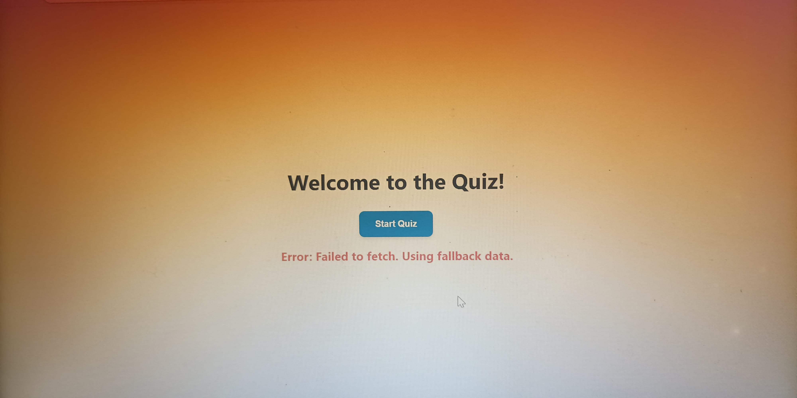
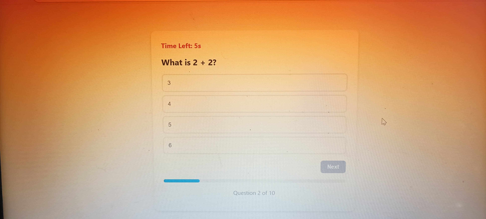

# Quiz App

## Overview
The **Quiz App** is a web-based application that allows users to take quizzes on various topics. It features a user-friendly interface, real-time feedback, and a score tracker. The app is built using **React** .

## Features
- **Multiple-choice questions**: Users can answer questions with multiple-choice options.
- **Real-time feedback**: Instant feedback on correct/incorrect answers.
- **Score tracker**: Displays the user's score at the end of the quiz.
- **Responsive design**: Works seamlessly on desktop, tablet, and mobile devices.

- ## Screenshots
Here are some screenshots of the application in action:

### Homepage

### Quiz Interface

### Results Page

## Video Walkthrough
Watch a short video demonstrating the app:

